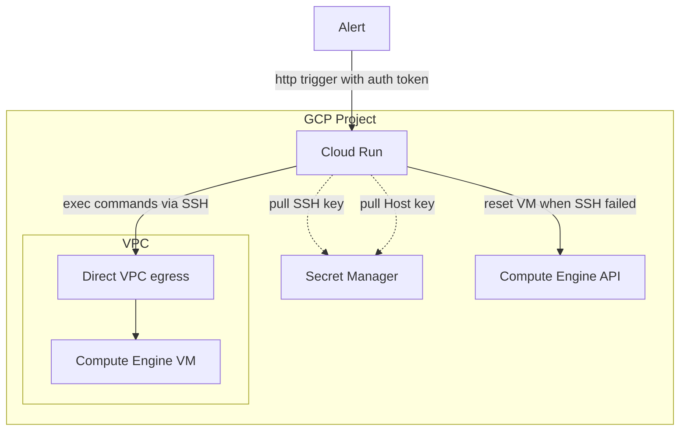

# Cloud Run Service with Event Trigger for GCE SSH Command Execution
This guide details setting up a Cloud Run service triggered by events (e.g., webhook) to execute commands via SSH on a Google Compute Engine (GCE) VM.



## Prerequisites
- A Google Cloud Project (GCP)
- A GCE VM with SSH access enabled

## Security Considerations
This approach involves storing SSH keys in Secret Manager and granting the Cloud Run service account access to the VM. Ensure you understand the security implications before deploying. Consider alternative secure access methods like Cloud IAM Service Accounts for VM access.

## Deployment Steps
1. Create Secrets
    - In [GCP Secret Manager](https://console.cloud.google.com/security/secret-manager), create two secrets:
      - `SECRET_MANAGER_SSH_KEY` containing your SSH private key.
      - `SECRET_MANAGER_HOST_KEY` containing your VM's public SSH host key (for verification).

2. Create Service Account
    - Create a service account with the following roles:
      - Secret Manager Secret Accessor
      - Compute Engine Instance Admin (v1) on the target GCE VM

3. Configure Cloud Run Service
    - Copy the sample service file:
      ```bash
      cp cloud-run/service-example.yaml cloud-run/service.yaml
      ```
    - Edit `cloud-run/service.yaml` using a text editor like `vim`. Replace the following placeholders with your specific values:
      - `<YOUR_VPC>`: Name of your VPC network.
      - `<YOUR_SUBNET>`: Name of the subnet within your VPC.
      - `<YOUR_SERVICE_ACCOUNT>`: Email of the service account created in step 2.
    - Environment Variables:

      The service definition uses environment variables to store sensitive information. **Do not** store them directly in the git repository.

      - `SECRET_MANAGER_SSH_KEY`: Referencing the secret name (e.g., `projects/<PROJECT_ID>/secrets/<SECRET_NAME>/versions/latest`)
      - `SECRET_MANAGER_HOST_KEY`: Referencing the secret name (e.g., `projects/<PROJECT_ID>/secrets/<SECRET_NAME>/versions/latest`)
      - `AUTH_TOKEN`: Define a custom authentication token for added security (replace with a random string)
      - `VM_IP`: Public IP address and port of your GCE VM (e.g., 10.0.0.1:22)
      - `VM_USER`: Username for SSH access on the VM
      - `PROJECT`: ID of the project containing the GCE VM
      - `ZONE`: Zone where your GCE VM resides
      - `INSTANCE`: Name of your GCE VM
      - `SSH_COMMAND`: The command to execute on the VM (e.g., sudo systemctl restart nginx)
      - `ENABLE_RESTART`: Boolean for enable reset GCE VM instance when SSH failed
4. Build and Push the Image (Assuming you're using Skaffold)
    - Run the following command, replacing placeholders with your values:
      ```bash
      skaffold build -p dev --file-output=artifacts.json -d <GAR> -t "<TAG>"
      ```
      - `<GAR>`: Google Artifact Registry URI (replace with your registry. e.g., `<REGION>-docker.pkg.dev/<PROJECT_ID>/<REPOSITORY_NAME>`)
      - `<TAG>`: Image tag for your container image

5. Deploy to Cloud Run
    - Deploy the service to Cloud Run using Skaffold:
      ```bash
      skaffold deploy -p dev -a artifacts.json --cloud-run-location=<REGION> --cloud-run-project=<PROJECT_ID>
      ```
      - `<REGION>`: The region which Cloud Run will deploy to.
      - `<PROJECT_ID>`: The ID of the GCP project which Cloud Run will deploy to.

## How to Trigger the Service
```bash
curl -H "Authorization: <AUTH_TOKEN>" https:/<CLOUD_RUN_URL>/api/v1/restart
```
- `<AUTH_TOKEN>`: A custom authentication token created in `Deployment Steps` step 3.
- `<CLOUD_RUN_URL>`: The URL of the Cloud Run service.
